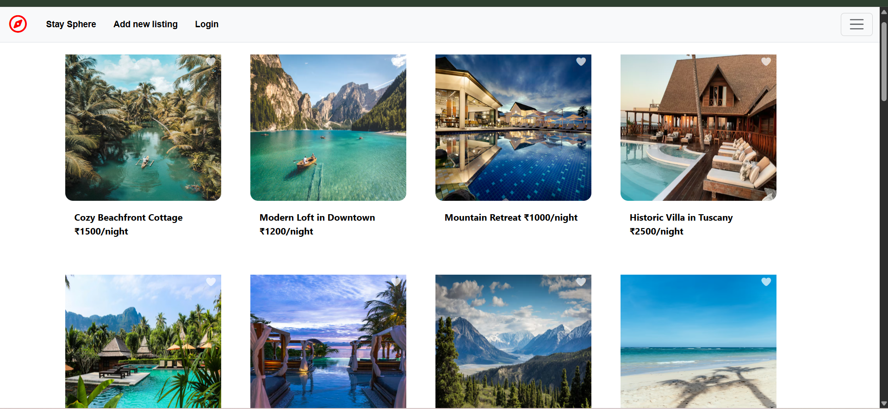
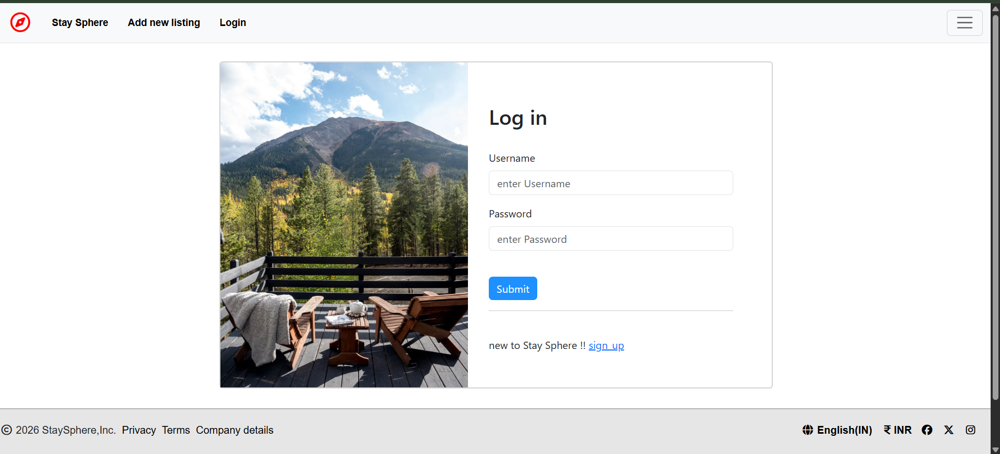
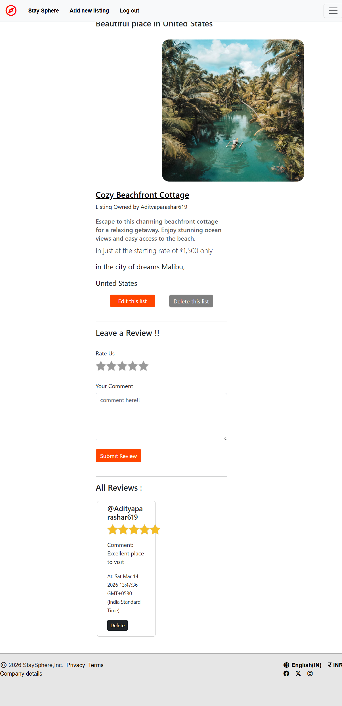

# StaySphere

A full-stack web application where users can explore, create, and review property listings with secure authentication and authorization.

---

## Live Demo

https://your-deployment-link.com

---

## Project Preview

Home Page


Login Page


Listing Page


---

## Key Features

### Authentication System

* Secure user **signup and login**
* Password hashing using **bcrypt**
* **Passport.js authentication**
* Persistent login sessions using **express-session**

### Authorization

* Only logged-in users can create listings or reviews
* Listing owners can edit or delete their own listings
* Review owners can delete their reviews
* Route protection using custom middleware

### Listings Management

* Create new property listings
* Upload images with **Cloudinary**
* Edit and delete listings
* View all listings with ratings

### Reviews & Ratings

* Users can add reviews
* Star rating system
* Review ownership validation

---

## Tech Stack

Backend

* Node.js
* Express.js
* MongoDB
* Mongoose

Frontend

* EJS
* CSS
* JavaScript

Authentication

* Passport.js
* bcrypt
* express-session

Media Storage

* Cloudinary

---

## Project Architecture (MVC)

```
controllers/   business logic
models/        database schemas
routes/        route handling
views/         EJS templates
public/        static assets
middleware/    authentication & authorization
utils/         helper utilities
config/        cloud configuration
```

---

## Environment Variables

Create a `.env` file:

```
DB_URL=your_mongodb_connection
CLOUDINARY_CLOUD_NAME=
CLOUDINARY_KEY=
CLOUDINARY_SECRET=
SESSION_SECRET=
```

---

## Installation

Git repository

```
https://github.com/AdityaParashar619/Stay-Sphere.git
```

Install dependencies

```
npm install
```

Run server

```
node app.js
```

Application runs on

```
http://localhost:3000
```

---

## Future Improvements

* Booking system
* Payment integration
* Search filters
* User profile dashboard

---

## Author

Aditya Parashar
